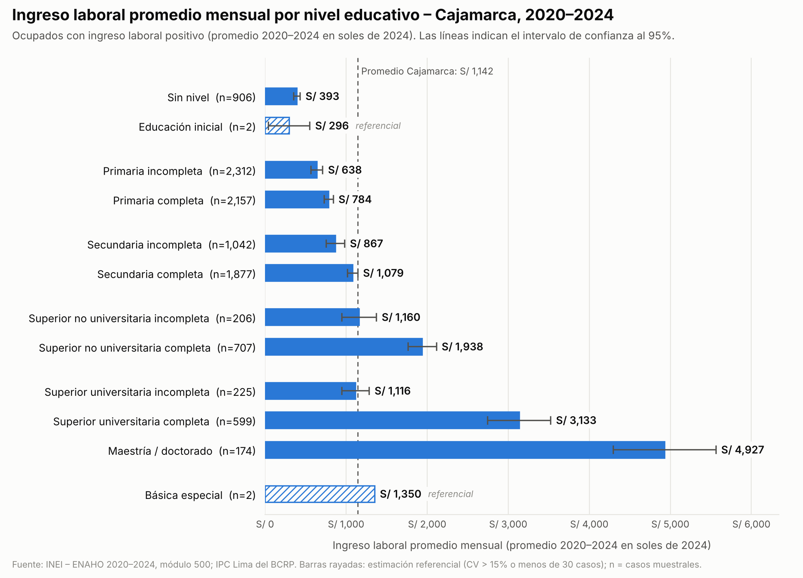

# Ingreso promedio por nivel educativo – Cajamarca (ENAHO 2020–2024)

Estima el ingreso laboral promedio mensual por nivel educativo en un departamento
del Perú (por defecto Cajamarca, ubigeo `06`) usando los microdatos de la
**ENAHO** del INEI. Por defecto combina (pooling) los años **2020 a 2024** para
ganar muestra en los niveles educativos poco frecuentes.

## Uso

```bash
pip install -r requirements.txt
python ingreso_por_educacion.py                    # Cajamarca, 2020-2024 combinados
python ingreso_por_educacion.py --anios 2024       # un solo año
python ingreso_por_educacion.py --departamento 15  # otro departamento (ubigeo de 2 dígitos)
python grafico_ingreso_educacion.py                # gráfico 2020-2024 con los 12 niveles de p301a
python grafico_ingreso_educacion.py --periodo 2024 # gráfico de un solo año
```

La primera ejecución descarga el módulo 05 de cada año (~17 MB comprimido cada uno) del
[portal de microdatos del INEI](https://proyectos.inei.gob.pe/microdatos/) a `datos/`,
que no se versiona. Los resultados se guardan en `resultados/` como CSV.

## Metodología

| Elemento | Definición |
|---|---|
| Base | ENAHO anual, archivo `enaho01a-AAAA-500.dta`. Códigos INEI: 2020 = 737, 2021 = 759, 2022 = 784, 2023 = 906, 2024 = 966 |
| Población | Ocupados (`ocu500 == 1`) con ubigeo del departamento |
| Ingreso | Suma anual de `i524a1, d529t, i530a, d536, i538a1, d540t, i541a, d543, d544t` ÷ 12: ocupación principal y secundaria, monetario y en especie, más ingresos extraordinarios |
| Precios | Con varios años, los ingresos se llevan a soles del último año con el IPC de Lima Metropolitana (BCRP, serie PN38705PM, promedio anual) |
| Nivel educativo | `p301a` (el archivo del módulo 500 ya la incluye y coincide al 100% con la del módulo 300) |
| Factor de expansión | `fac500a` ÷ número de años (la población expandida es un promedio anual) |
| Varianza | Linealización de Taylor; estratos = `estrato`, UPM = `conglome`, estimación de dominio sobre la muestra nacional. Un conglomerado visitado varios años (panel) cuenta como una sola UPM |
| Confiabilidad | "referencial" si CV > 15%, n < 30 o la varianza no es estimable (todos los casos en un solo conglomerado) |

Se generan estas tablas (`*` = `ingreso_educacion_06_2020-2024`):

- `*_grupos.csv`: **definición principal**. Ocupados con ingreso > 0, por etapa educativa.
  Excluye a los trabajadores familiares no remunerados, que reportan ingreso cero.
  Básica especial se mantiene como categoría propia.
- `*_detalle.csv`: la misma población con las 12 categorías de `p301a`.
- `*_grupos_todos_ocupados.csv`: todos los ocupados, incluidos los de ingreso cero.
- `*_por_anio.csv`: ingreso promedio total de cada año, en soles de 2024.

Los archivos `ingreso_educacion_06_2024_*` son las mismas tablas solo con la ENAHO 2024, en soles corrientes.

## Resultados – Cajamarca 2020–2024 (ocupados con ingreso, S/ de 2024 por mes)

| Nivel educativo | n | Promedio | IC 95% | Mediana |
|---|---:|---:|---|---:|
| Primaria o menos | 5,377 | 669 | 623 – 716 | 465 |
| Secundaria | 2,919 | 1,007 | 943 – 1,071 | 754 |
| Superior no universitaria | 913 | 1,742 | 1,600 – 1,885 | 1,321 |
| Superior universitaria | 998 | 2,872 | 2,534 – 3,210 | 2,465 |
| Básica especial (referencial) | 2 | 1,350 | no estimable | 1,367 |
| **Total** | 10,211 | **1,142** | 1,060 – 1,225 | 702 |

### Detalle por los 12 niveles educativos de la ENAHO



Al combinar los cinco años, todos los niveles son confiables (CV < 10%) salvo
"Educación inicial" (2 casos) y "Básica especial" (2 casos, ambos de 2023 y del
mismo conglomerado), que siguen siendo solo referenciales.

## Advertencias

- 2020 fue un año de pandemia. Su ingreso promedio (S/ 1,025 en soles de 2024) es el más bajo del periodo y reduce un poco el promedio combinado; ver `*_por_anio.csv`.
- Los conglomerados de la ENAHO se repiten casi todos entre años (componente panel), así que combinar 5 años no quintuplica la información efectiva. La varianza lo toma en cuenta.
- Las variables `i*` son imputadas y las `d*` deflactadas, como las entrega el INEI.
- Las cifras no son directamente comparables con las de la EPEN (por ejemplo, el S/ 1,766 nacional de 2024), que es una encuesta urbana con otra metodología.
