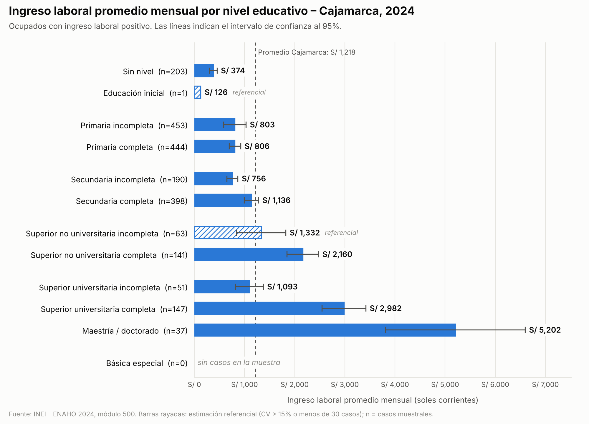

# Ingreso promedio por nivel educativo – Cajamarca (ENAHO 2024)

Estima el ingreso laboral promedio mensual por nivel educativo en un departamento
del Perú (por defecto Cajamarca, ubigeo `06`) usando los microdatos de la
**ENAHO 2024** del INEI.

## Uso

```bash
pip install -r requirements.txt
python ingreso_por_educacion.py                    # Cajamarca, 2024
python ingreso_por_educacion.py --departamento 15  # otro departamento (ubigeo de 2 dígitos)
python grafico_ingreso_educacion.py                # gráfico con los 12 niveles de p301a
```

La primera ejecución descarga el módulo 05 (~17 MB comprimido) del
[portal de microdatos del INEI](https://proyectos.inei.gob.pe/microdatos/) a `datos/`,
que no se versiona. Los resultados se guardan en `resultados/` como CSV.

## Metodología

| Elemento | Definición |
|---|---|
| Base | ENAHO 2024 (código INEI 966), archivo `enaho01a-2024-500.dta` |
| Población | Ocupados (`ocu500 == 1`) con ubigeo del departamento |
| Ingreso | Suma anual de `i524a1, d529t, i530a, d536, i538a1, d540t, i541a, d543, d544t` ÷ 12: ocupación principal y secundaria, monetario y en especie, más ingresos extraordinarios |
| Nivel educativo | `p301a` (el archivo del módulo 500 ya la incluye y coincide al 100% con la del módulo 300) |
| Factor de expansión | `fac500a` |
| Varianza | Linealización de Taylor; estratos = `estrato`, UPM = `conglome`, estimación de dominio sobre la muestra nacional |
| Confiabilidad | "referencial" si CV > 15% o n < 30 |

Se generan tres tablas:

- `*_grupos.csv`: **definición principal**. Ocupados con ingreso > 0, en 4 grupos educativos.
  Excluye a los trabajadores familiares no remunerados (387 casos en Cajamarca), que reportan ingreso cero.
- `*_detalle.csv`: la misma población con las 12 categorías de `p301a`.
- `*_grupos_todos_ocupados.csv`: todos los ocupados, incluidos los de ingreso cero.

## Resultados – Cajamarca 2024 (ocupados con ingreso, S/ por mes)

| Nivel educativo | n | Promedio | IC 95% | Mediana |
|---|---:|---:|---|---:|
| Primaria o menos | 1,101 | 737 | 623 – 851 | 502 |
| Secundaria | 588 | 1,022 | 914 – 1,130 | 740 |
| Superior no universitaria | 204 | 1,887 | 1,635 – 2,139 | 1,368 |
| Superior universitaria | 235 | 2,852 | 2,367 – 3,338 | 2,405 |
| **Total** | 2,128 | **1,218** | 1,096 – 1,339 | 721 |

Todos los grupos tienen CV < 10%.

### Detalle por los 12 niveles educativos de la ENAHO



"Básica especial" no tiene casos entre los ocupados con ingreso de Cajamarca, y
"Educación inicial" (1 caso) y "Superior no universitaria incompleta" (CV 19%)
son solo referenciales.

## Advertencias

- Los montos están en soles corrientes de 2024. Las variables `i*` son imputadas y las `d*` deflactadas, como las entrega el INEI.
- Las cifras no son directamente comparables con las de la EPEN (por ejemplo, el S/ 1,766 nacional de 2024), que es una encuesta urbana con otra metodología.
- Varias categorías del detalle tienen pocos casos. Para cortes más finos (por ejemplo, por área urbana o rural) conviene juntar varios años de ENAHO.
